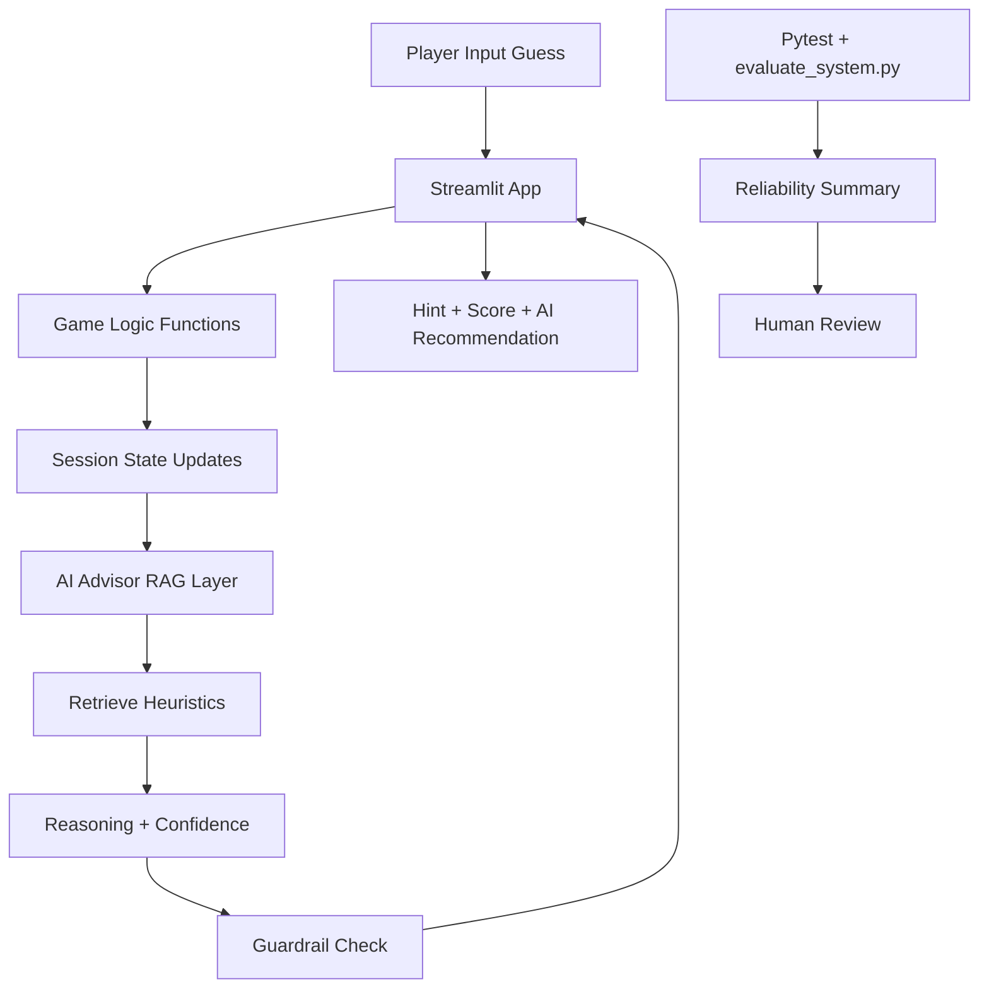

# AI Strategy Guesser: Applied AI System

## Project Summary
AI Strategy Guesser is an upgraded version of the Streamlit number-guessing game that now includes a retrieval-augmented AI advisor. Instead of only giving basic higher/lower hints, the system retrieves strategy context, reasons over prior outcomes, recommends the next guess, and reports confidence with guardrails.

This project demonstrates end-to-end applied AI engineering with modular logic, explainability, reliability testing, and professional documentation.

## Original Project (Module 1-3 Base)
Original project: **Game Glitch Investigator (Module 1)**.

The original project focused on debugging an AI-generated guessing game with broken hints and unstable session state. Its main capabilities were selecting difficulty, submitting guesses, and scoring a game round. This final project extends that baseline into a complete applied AI system with retrieval, reasoning trace, confidence scoring, and reliability evaluation.

## Required AI Feature
This project implements **Retrieval-Augmented Generation (RAG)-style behavior** in a deterministic local advisor:

1. Retrieves relevant strategy snippets from a small knowledge base.
2. Uses game history to compute valid candidate bounds.
3. Recommends a next guess and confidence score.
4. Blocks unsafe recommendations when history is contradictory.

The feature is integrated into the app flow via:
- `Enable AI advisor`
- `AI Take Turn`
- AI explanation and confidence output after each round

## Architecture Overview
Core components:

1. Streamlit UI (`app.py`)
2. Game logic module (`logic_utils.py`)
3. AI advisor module (`ai_advisor.py`)
4. Reliability/evaluation scripts (`tests/`, `evaluate_system.py`)

Data flow diagram:



Diagram source is also saved in `assets/system_architecture.mmd`.

## Setup Instructions
1. Create and activate a virtual environment (recommended).
2. Install dependencies:

```bash
pip install -r requirements.txt
```

3. Run the Streamlit app:

```bash
python -m streamlit run app.py
```

4. Run tests:

```bash
pytest
```

5. Run evaluation harness:

```bash
python evaluate_system.py
```

## Sample Interactions
### Interaction 1: Fresh game with AI recommendation
Input state: `difficulty=Normal`, no prior guesses.

Output:
- AI recommends guess `50`
- Confidence is moderate (`~0.45`)
- Retrieved strategy includes midpoint and bounds guidance

### Interaction 2: After two rounds
Input rounds:
- Guess `50` -> `Too High`
- Guess `25` -> `Too Low`

Output:
- Computed bounds become `[26, 49]`
- AI recommends `37`
- Confidence increases due to reduced candidate range

### Interaction 3: Contradictory state
Input rounds:
- Guess `30` -> `Too Low`
- Guess `25` -> `Too High`

Output:
- AI guardrail triggers
- Recommendation is blocked
- UI asks user to reset game state

## Design Decisions and Trade-Offs
1. Local deterministic advisor over external LLM API.
Trade-off: stronger reproducibility and no API key requirement, but less expressive language generation.

2. Transparent reasoning trace in UI.
Trade-off: better auditability, but slightly more verbose interface.

3. Heuristic confidence score.
Trade-off: practical for this domain, but not statistically calibrated for real-world risk decisions.

## Reliability and Evaluation
Reliability methods used:

1. Unit tests for core game logic and advisor behavior.
2. Scenario-based evaluation script (`evaluate_system.py`) with pass/fail summary.
3. Guardrail behavior for contradictory histories.

Latest summary:
- All pytest tests pass.
- Evaluation script scenarios pass.
- Advisor confidence increases as the search space narrows.

## Testing Summary
What worked:
- Bounds logic, midpoint recommendation, and scoring flow were consistent.
- Guardrail behavior prevented unsafe recommendations.

What did not work initially:
- Early drafts allowed contradictory hints to produce guesses.

What changed:
- Added explicit consistency checks and blocked output on conflict.

## Reflection
This project reinforced that AI reliability depends on system design, not just model output quality. Confidence, retrieval trace, and guardrails made behavior easier to inspect and trust. Iterative testing showed that deterministic checks are powerful for controlling failure modes in small applied AI systems.

## Loom Walkthrough
Add your recording link here:

- Loom demo: `PASTE_YOUR_LOOM_LINK_HERE`

Video checklist coverage:
- End-to-end run with 2-3 inputs
- AI feature behavior
- Reliability/guardrail behavior
- Clear outputs for each case

## Portfolio Artifact
What this project says about me as an AI engineer:

I design AI systems with a reliability-first mindset: observable reasoning, safe failure modes, and measurable behavior. I can take a buggy prototype and evolve it into a modular, testable, and production-minded applied AI artifact.

## Assets and Evidence
- Architecture source: `assets/system_architecture.mmd`
- Demo screenshots: `screenshots/winning-game.png`, `screenshots/pytest-passing.png`
- Reflection and ethics: `model_card.md`
